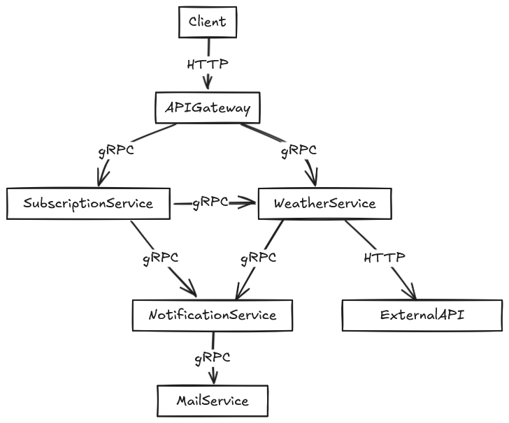

# **ADR-003: Choice of Communication Type Between Microservices**

**Status**: Accepted\
**Date**: 2025-08-08\
**Author**: Hushchin Ivan

## Context

Need to choose effective and scalable way of communication between each microservice.

## Considered options

1. **HTTP(REST)**

   - ➕ Simple and familiar
   - ➕ Easy debugging
   - ➖ Uses more CPU resources and time on frequent requests
   - ➖ Synchronous client-server requests only

2. **Message Brokers**

   - ➕ Asynchronous communication
   - ➕ Good for load balancing
   - ➖ Harder to scale
   - ➖ Requires major architectural changes

3. **gRPC**
   - ➕ High-perfomance
   - ➕ Supports streaming
   - ➕ Strict contracts
   - ➖ Harder to learn
   - ➖ Harder to debug
   - ➖ Requires some setup and maintaining
   - ➖ Overhead for small projects(no significant perfomance improvements)

## Decision

**gRPC**

## Diagram

