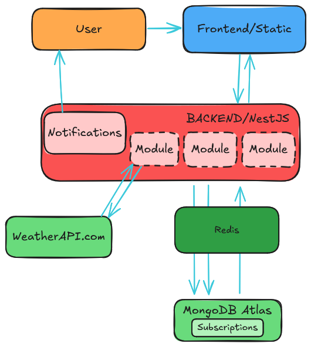

# System Design: WeatherForecastAPI

## 1. Вимоги системи

### Функціональні вимоги

- Отримання поточних даних про погоду в обраному місті
- Підписка на розсилку погоди в обраному місті
- Керування підписками
  - оновлення, видалення
  - тип, частота
- Підтвердження підписки через повідомлення
- Можливість відписатись від розсилки
- Підтримка різних типів повідомлень

### Нефункціональні вимоги

- _Доступність_
  - Робота без перебоїв при високому навантаженні
  - 99.9% uptime
- _Масштабованість_
  - Підтримка горизонтального масштабування
- _Безпека_
  - Валідація усіх введених користувачем даних
  - Https
- _Надійність_
  - Обробка помилок зовнішніх API
  - Гарантована доставка повідомлень
- _Продуктивність_
  - Кешування погодних даних
  - Середній час відповіді не перевищує 500мс

### Обмеження

- Обмеження зовнішнього API
  - Кількість запитів в місяць(1 млн)
  - Обмежене географічне покриття
- Обмеження notification сервісів
  - Кількість запитів
  - Частота відправки

## 2. High-level архітектура

## 3. Компоненти

### 3.1 Weather

_Відповідальність_:

- Звертається до зовнішнього API
- Кешування даних погоди для зменшеня навантаження на API та підвищення ефективності
- Отримує певної інормації про погоду

_Endpoints_:

- GET /weather?city={city_name}

### 3.2 Subscriptions

_Відповідальність_:

- Управління збереженними даними про підписки користувачів
- Створення, оновлення підписок
- Підтвердження підписки та відписка

_Endpoints_:

- POST /subscribe
- GET /confirm/:token
- GET /unsubscribe/:token
- PUT /subscriptions/:id
- DELETE /subscriptions/:id

### 3.3 Notifications

_Відповідальність_:

- Відправка повідомлень(email, SMS, push-повідомлення) з підтвердженням підписки
- Розсилка погоди згідно з налаштуваннями користувача

## 4. Деталі реалізації

_Кешування_

- **Redis:**
  - Зберігає поточні погодні дані (TTL 10 хвилин).

- **Fallback vеханізм:**
  - Останні кешовані дані
